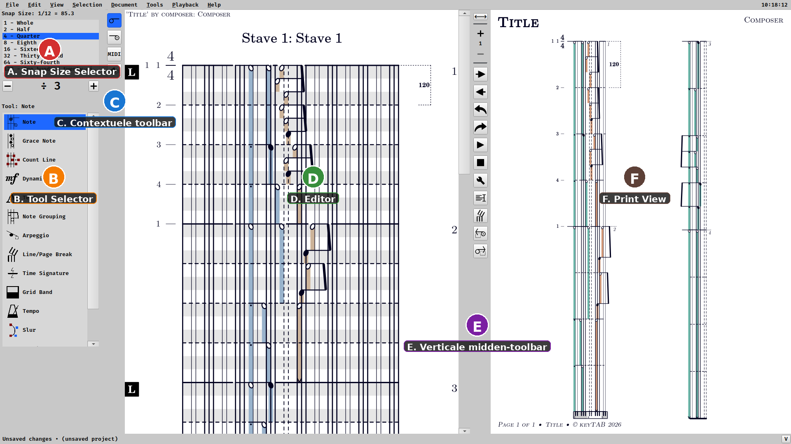
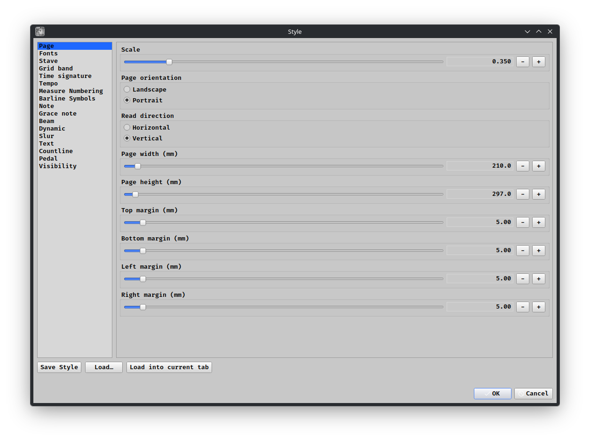
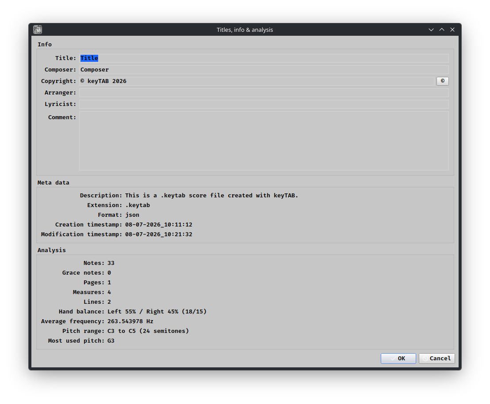
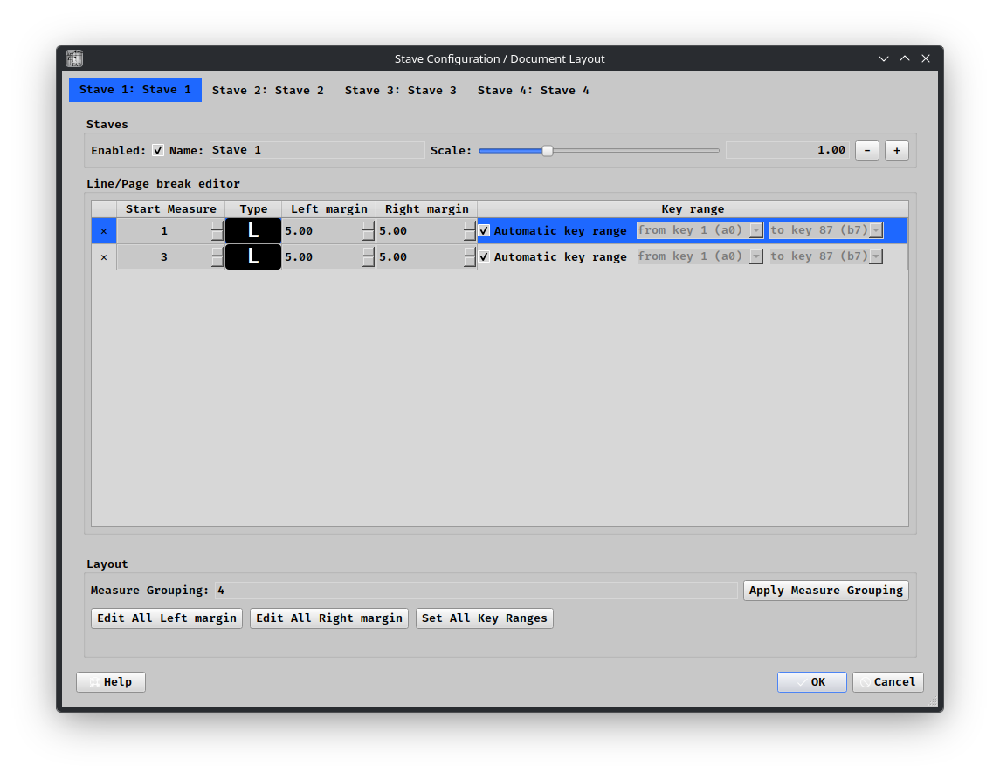

# keyTAB Handleiding (NL)

## 1. Doel van deze handleiding

Deze handleiding legt eerst de basis van de gebruikersinterface uit. Daarna volgt een praktisch overzicht van de gereedschappen, gebaseerd op de tooltipteksten uit de applicatie.

## 2. Basisopbouw van het scherm

keyTAB is opgebouwd uit drie hoofdgebieden die u tegelijk ziet:

1. Links: Tool Selector (gereedschappen en contextopties)
2. Midden: Editor (hier plaatst en bewerkt u objecten)
3. Rechts: Print View (afdrukweergave van het resultaat)

Tussen de Editor en de Print View staat een verticale toolbar met snelle acties.

## 3. Basisbediening met de muis

De volgende regels gelden in het algemeen voor alle tools:

1. Linkerklik op lege ruimte: nieuw object plaatsen
2. Linkerklik/sleep op bestaand object: object bewerken
3. Rechterklik op bestaand object: object verwijderen
4. U kunt alleen objecttypes bewerken die horen bij de actieve tool

## 4. Tool Selector (links): twee delen

De Tool Selector bestaat uit twee onderdelen:

1. Categorie-listbox met iconen en tekst
   Hier kiest u de actieve toolcategorie, zoals Noot, Dynamiek, Tekst of Tempo.

2. Contextuele toolbar naast de listbox
   Deze smalle toolbar staat direct tegen de Tool Selector aan en verandert mee met de gekozen tool. U kiest hier subtypes of contextacties die bij die tool horen.

## 5. Verticale toolbar tussen Editor en Print View

Van boven naar beneden:

1. Fit-knop (fit/splitter)
   Past de pagina in beeld in de Print View. Via deze knop/splitter kunt u ook de verhouding tussen Editor en Print View aanpassen.

2. Stave selector (+, nummer, -)
   Selecteert de actieve stave (balk). Met plus/min kiest u respectievelijk de volgende of vorige stave.

3. Volgende pagina
   Ga naar de volgende afdrukpagina.

4. Vorige pagina
   Ga naar de vorige afdrukpagina.

5. Undo
   Laatste bewerking ongedaan maken. Sneltoets: Ctrl+Z.

6. Redo
   Laatste ongedaan gemaakte bewerking opnieuw uitvoeren. Sneltoets: Ctrl+Shift+Z.

7. Play
   Afspelen vanaf de huidige cursorpositie. Sneltoets: spatie (toggle).

8. Stop
   Afspelen direct stoppen. Sneltoets: spatie (toggle).

9. Style
   Opent de stijlinstellingen voor de visuele opmaak van de partituur.

10. Info
    Opent titelinfo en analyse-informatie.

11. Line Breaks
    Opent instellingen voor regel- en pagina-indeling (systemen en pagina's).

12. Selectie naar linkerhand
    Zet geselecteerde noten op linkerhand. Sneltoets: \[

13. Selectie naar rechterhand
    Zet geselecteerde noten op rechterhand. Sneltoets: ]

## 6. Gereedschappen in de Tool Selector

Hieronder staat per tool wat u ermee doet.

### 6.1 Noot

* Linksklik/sleep op bestaande noot: duur of positie aanpassen

* Linksklik/sleep in lege ruimte: nieuwe noot maken en instellen

* Rechtsklik: noot verwijderen

* Dubbelklik: aangepaste nootkop instellen of resetten

### 6.2 Voorslagnoot

* Linksklik/sleep op bestaande voorslag: verplaatsen

* Linksklik/sleep in lege ruimte: nieuwe voorslagnoot maken

* Rechtsklik: voorslagnoot verwijderen

### 6.3 Tellijn

* Linksklik/sleep op handle: begin/einde en tijd aanpassen

* Linksklik/sleep in lege ruimte: tellijn maken en eind-handle slepen

* Rechtsklik: tellijn verwijderen via handle

### 6.4 Dynamiek

* Linksklik/sleep: bestaand dynamiekitem bewerken (hairpin of symbool)

* Linksklik/sleep in lege ruimte: nieuw dynamiekitem plaatsen

* Rechtsklik: dynamieksymbool of hairpin verwijderen

### 6.5 Note Grouping (Beam)

* Linksklik/sleep op marker: duur aanpassen

* Linksklik/sleep in lege ruimte: marker maken en duur instellen

* Rechtsklik: marker onder cursor verwijderen

### 6.6 Arpeggio

* Linksklik op akkoordnoot: arpeggio met gekozen type toevoegen

* Sleep eind-handles: spreidingsduur aanpassen

* Rechtsklik: arpeggio onder cursor verwijderen

### 6.7 Regel/Pagina-breekmarker

* Linksklik/sleep op marker: bewerken of verplaatsen

* Klik op marker: wissel tussen regel- en paginabreekgedrag

* Linksklik/sleep in lege ruimte: nieuwe breekmarker maken

* Rechtsklik: marker verwijderen

### 6.8 Maatsoort

* Linksklik op maatstreep: maatsoortdialoog openen

* Linksklik buiten maatstreep: rasterlijn toevoegen

* Linksklik/sleep in lege ruimte: onderverdeling toevoegen

* Rechtsklik: onderverdeling of maatsoortwijziging verwijderen

### 6.9 Rasterband

* Linksklik/sleep op marker: duur aanpassen

* Linksklik/sleep in lege ruimte: rasterband-marker maken

* Rechtsklik: stop-marker (nulduur) invoegen of verwijderen

### 6.10 Tempo

* Linksklik op bestaand tempo: BPM aanpassen

* Sleep op tempo: duur aanpassen

* Linksklik/sleep in lege ruimte: tempo-marker maken

* Rechtsklik: tempo verwijderen (eerste tempo niet)

### 6.11 Legatoboog

* Linksklik/sleep op controlepunt: boogvorm aanpassen

* Linksklik/sleep in lege ruimte: nieuwe boog maken en vormen

* Rechtsklik: boog verwijderen

### 6.12 Tekst

* Linksklik/sleep op tekst: verplaatsen

* Sleep rode handle: rotatie aanpassen

* Linksklik/sleep in lege ruimte: nieuw tekstobject maken

* Rechtsklik: tekstobject verwijderen

### 6.13 Maatstreepsymbolen

* Linksklik/sleep: geselecteerd symbool plaatsen op geklikte positie

* Linksklik/sleep in lege ruimte: herhaalbegin, herhaaleinde of dubbele maatstreep maken

* Rechtsklik: dichtstbijzijnd maatstreepsymbool verwijderen

### 6.14 Pedaal

* Linksklik/sleep op bestaand symbool: verplaatsen

* Gekoppelde omhoog/omlaag-symbolen bewegen samen wanneer ze gelinkt zijn

* Linksklik/sleep in lege ruimte: nieuw pedaalsymbool maken

* Rechtsklik: pedaalsymbool verwijderen

* Dubbelklik: symboolzichtbaarheid in gravure aan/uit

## 7. Praktische werkvolgorde (aanbevolen)

1. Kies links eerst een toolcategorie
2. Controleer de contextuele toolbar voor subtype/opties
3. Plaats en bewerk in de Editor
4. Controleer direct rechts in de Print View
5. Gebruik de midden-toolbar voor pagina, afspelen, stijl en documentinfo

## 8. Volgende hoofdstukken

Na deze basisinterface is een logische volgende stap:

1. Document opmaak met Style
2. Titel- en metadata met Info
3. Regel- en paginaopbouw met Line Breaks
4. Een korte oefening: van leeg project naar eerste complete pagina

## 9. Visuele Rondleiding Met Screenshots

Dit hoofdstuk gebruikt de beschikbare screenshots als snelle wegwijzer door de basisinterface en de belangrijkste vensters.

### 9.1 Hoofdinterface

Wat u hier ziet:

* A. Snap Size Selector (linksboven)
  Bepaalt de stapgrootte van de cursor over de tijdslijn. Hoe fijner de snap-waarde, hoe preciezer u in de tijd kunt plaatsen en verplaatsen.

* B. Tool Selector (links)
  Lijst met toolcategorieen om objecten te plaatsen, te bewerken of te verwijderen.

* C. Contextuele toolbar
  Opties die horen bij de actieve tool, direct naast de Tool Selector.

* D. Editor (midden)
  Werkgebied waar u de notatie op de tijdslijn bewerkt.

* E. Verticale midden-toolbar
  Snelle knoppen voor pagina-navigatie, undo/redo, playback en dialoogvensters.

* F. Print View (rechts)
  Weergave van de uiteindelijke pagina-opmaak en afdruklayout.

Praktisch gebruik:

1. Kies eerst de tool links
2. Bewerk in de Editor
3. Controleer direct in de Print View

### 9.2 Uiterlijk Instellen (Style)

Dit venster opent via de knop Style in de verticale midden-toolbar.

Gebruik dit venster voor:

1. Visuele stijl van de partituur
2. Weergavekeuzes voor leesbaarheid en drukresultaat
3. Consistente opmaak over het hele document

Tip: pas eerst globale stijlkeuzes toe, en ga daarna pas detailmatig objecten bewerken.

### 9.3 Titel En Analyse (Info)

Dit venster opent via de knop Info in de verticale midden-toolbar.

Gebruik dit venster voor:

1. Titelgegevens (zoals titel, componist en copyright)
2. Analyse-informatie van het document

Tip: vul de titelinformatie vroeg in, zodat export en documentbeheer direct correct zijn.

### 9.4 Documentindeling (Line Breaks / Layout)

Dit venster opent via de knop Line Breaks in de verticale midden-toolbar.

Gebruik dit venster voor:

1. Regelafbrekingen (systemen)
2. Pagina-opbouw
3. Verdeling van de muziek over de pagina's

Tip: werk eerst muzikaal inhoudelijk, en verfijn daarna de pagina-indeling in een laatste opmaakronde.

## 10. Snelle Start In 5 Stappen

1. Kies links een tool (bijvoorbeeld Noot)
2. Plaats en bewerk noten in de Editor
3. Controleer resultaat in de Print View
4. Gebruik Style en Info voor opmaak en documentgegevens
5. Gebruik Line Breaks om de pagina-opbouw af te ronden
